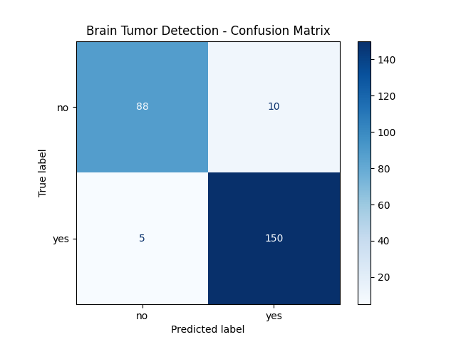

## 🧠 Brain Tumor Detection using CNN

This project implements a Convolutional Neural Network (CNN) in TensorFlow/Keras to classify MRI brain images as **Tumor** or **No Tumor**. It covers data loading, augmentation, model training, prediction, and evaluation.

---

### 📂 Dataset Structure

```
dataset/
├── brain_tumor_train_dataset/
│   ├── no/
│   └── yes/
├── brain_tumor_test_dataset/
│   ├── no/
│   └── yes/
└── prediction/
    ├── image1.jpeg
    ├── image2.jpeg
    └── ...
```

- **brain_tumor_train_dataset/** — Training images.
- **brain_tumor_test_dataset/** — Testing images.
- **prediction/** — Images for prediction after training.

---

### ⚙️ Requirements

- Python 3.11.9
- TensorFlow
- Keras
- NumPy
- pandas
- scikit-learn
- matplotlib

Install with:

```bash
pip install tensorflow keras numpy pandas scikit-learn matplotlib
```

---

### 🚀 How to Run

1️⃣ **Load and Preprocess Data**

- Images resized to 64x64 and batched.
- Normalization and augmentation (flip, zoom, rotation).

2️⃣ **Build CNN**

- Two Conv2D + ReLU + MaxPooling blocks.
- Fully connected Dense layers.
- Sigmoid activation for binary output.

3️⃣ **Train Model**

- Adam optimizer, binary crossentropy.
- 100 epochs with validation.

4️⃣ **Predict on New Images**

- Loads images from `prediction/` folder.
- Prints predicted class for each.

5️⃣ **Evaluate Model**

- Confusion matrix, accuracy score, classification report.
- Confusion matrix plotted using matplotlib.

---

### 🏁 Run Example

```bash
python your_script.py
```

Replace `your_script.py` with your Python file name.

---

### 📊 Sample Output

```
image1.jpg --> Tumor
image2.jpg --> No_Tumor

Confusion Matrix :
 [[TN FP]
  [FN TP]]
Accuracy Score = XX %
Classification Report :
               precision  recall  f1-score  support
```

### 📊 Prediction Output

1 no.jpeg --> no [No_Tumor]  
Y7.jpg --> yes [Tumor]

Confusion Matrix :

[[88 10]  
 [5 150]]

Confusion Matrix Figure:



Accuracy Score = 94 %

Classification Report :

|           | precision | recall | f1-score | support |
|-----------|-----------|--------|----------|---------|
| 0         | 0.946237  | 0.897959 | 0.921466 | 98.000000 |
| 1         | 0.937500  | 0.967742 | 0.952381 | 155.000000 |
| accuracy  |           |         | 0.940711 |  |
| macro avg | 0.941868  | 0.932851 | 0.936923 | 253.000000 |
| weighted avg | 0.940884 | 0.940711 | 0.940406 | 253.000000 |


---

### ✅ Key Features

- Data augmentation for better generalization.
- Simple, effective CNN for binary classification.
- Supports batch prediction and evaluation.

---

### 📌 Notes

- Organize images in the required folders.
- Tune hyperparameters (layers, epochs) for better results.

---

### ✨ Author

> **Fernando Sutanto**

Feel free to adapt this project for learning or research purposes! I got the Brain Tumor Dataset from Kaggle
